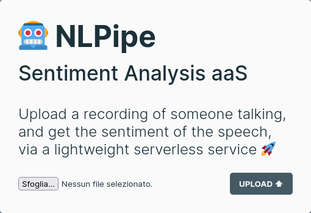

	<h1>🤖 NLPipe</h1>
	
Serverless Sentiment Analysis

	
By <a href="//github.com/fortym2">Davide Quaranta</a>, <a href="//github.com/dansolombrino">Daniele Solombrino</a>, <a href="//github.com/edogab33">Edoardo Gabrielli</a>

|||
|---|---|

## What is it?

NLPipe is a serverless infrastructure to perform sentiment analysis out of audio files. It has been developed as a project for the **Cloud Computing 2020-2021 course** at Sapienza University of Rome.

The system is composed of multiple **independent components** the perform specific tasks; specifically:

- A **web interface** that allows the user to upload audio files.
- A **REST API** that handles the interaction between the web interface and the backend.
- A **storage** space for the uploaded files.
- A **pipeline** of functions, one for each step:

  - Speech to text.
  - Text sentiment analysis.
  - Logic to store final results.
- A **database** to store the result of the performed sentiment analysis.

The system is **cloud-native** for Amazon Web Services and is deployed with the following AWS services:

- **Web interface and API**: container on **AWS Fargate**.
- **Pipeline**: chain of functions on **AWS Lambda**, connected via AWS Destinations.
- **Database**: Amazon **DynamoDB**.
- **Storage**: Amazon **S3**.

## How does it work?

The system's **architecture**, focusing on the AWS services used is the following.

The interaction flow between the components can be synthesized in the following **sequence diagram**.

